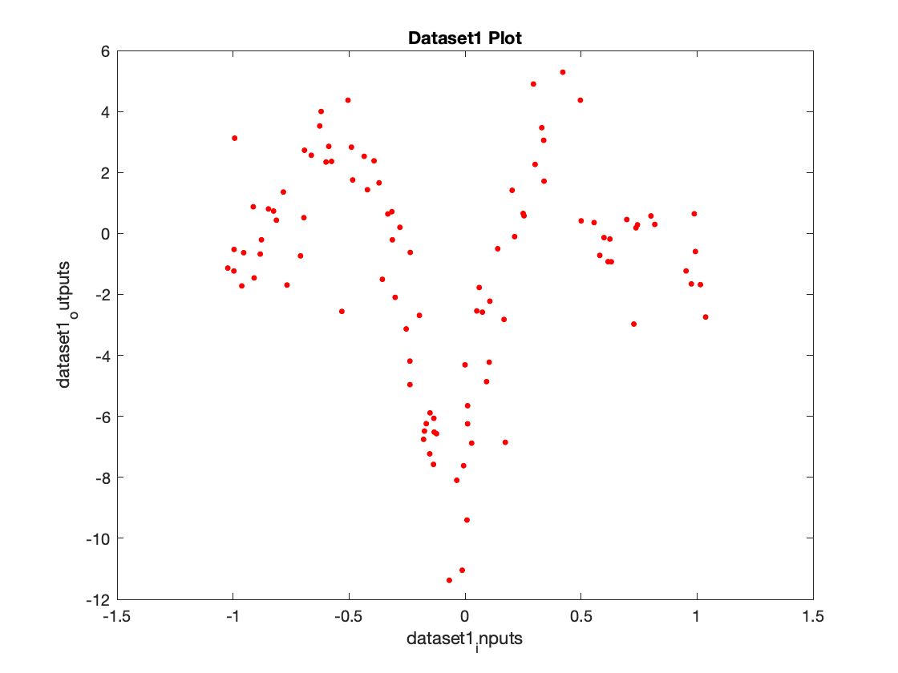
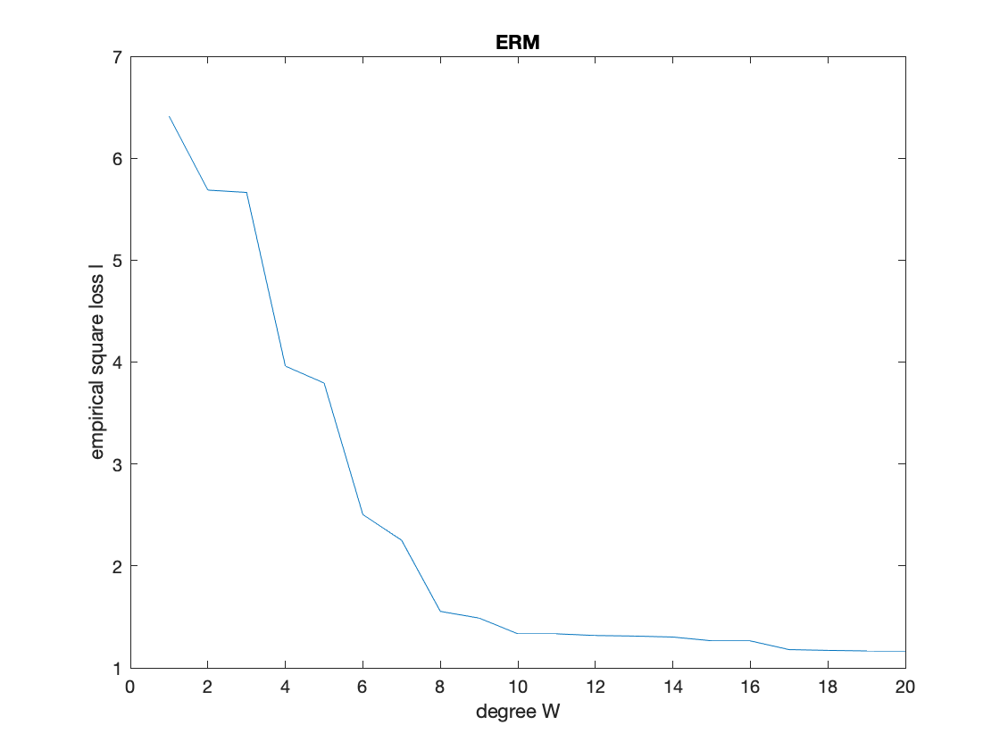
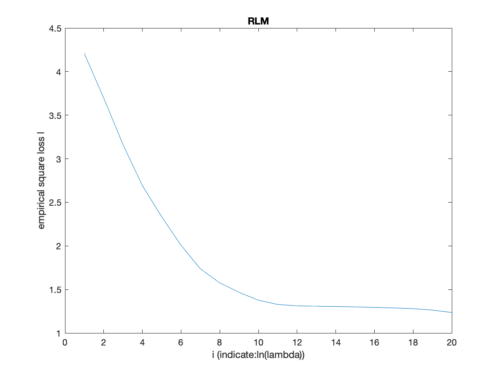
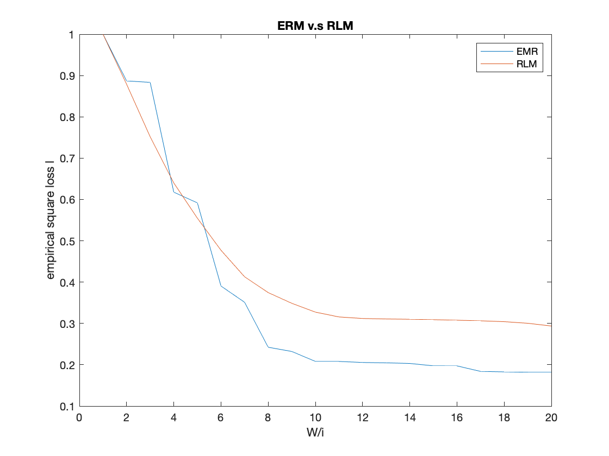
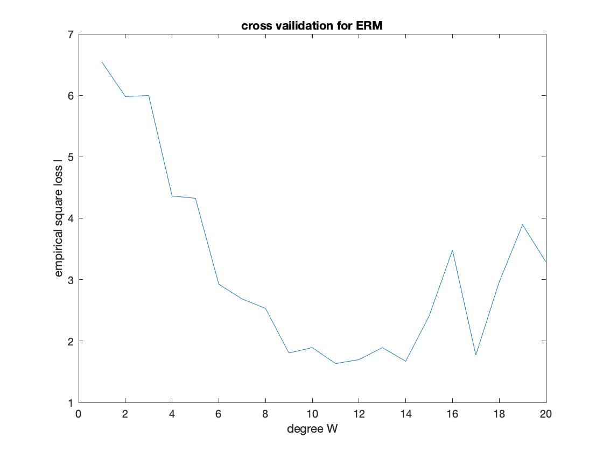
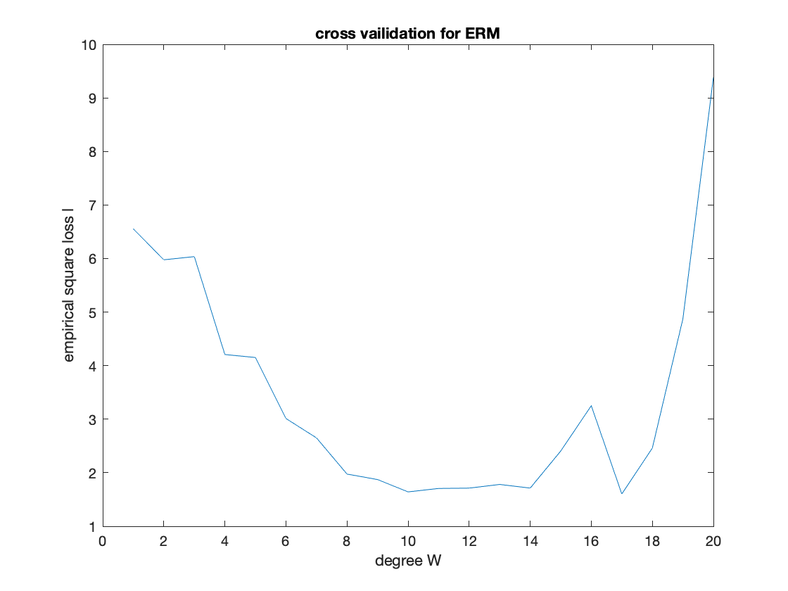
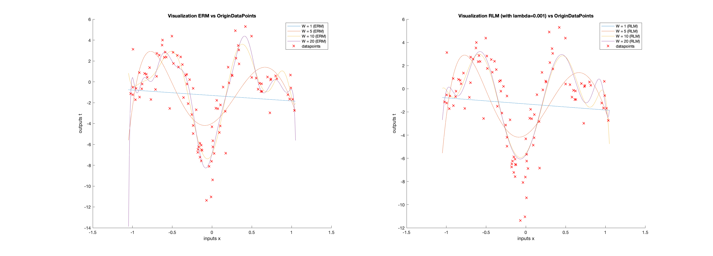

## 4. Liner Regression

### Step 1 - load the data



### Step 2 - ERM

Plot the empirical square loss on the data with degrees $W = 1, .., 20$.



Based on the plot, when degree $W > 10$ the loss would be much less than other dergree. $W = 20$ has least loss, it is suitable when we do not consider overfit so far.

### Step 3 - RLM



based on the plot, when degree $W = 20$ and the $ln(\lambda) ={-1,-2,..,-20}$, after $ln(\lambda) < -10$, loss would be much less than other dergree. $ln(\lambda) = -20$ has least loss, it is suitable when we do not consider overfit so far.

#### compare ERM and RLM

Note: we nomalize the loss into $(0,1)$, for comparing ERM and RLM



When degree $W = 20$, $ln(\lambda) ={-1,-2,..,-20}$ to regularize. We can see after regularization, the empirical square loss would be higher than before regularization. Although, the loss is a little bit higher, but it would balance the loss and regularizer, which would avoid the overfitting problem.

### Step 4 - cross validation





We can see when we use cross validation for ERM, $W = 20$ is not lowest loss yet, because of overfitting degree larger than $10$. Although each time the curves have some difference, the tendency would be same. Thus, $W = 10$ ~ $12$ is suitable after consider the overfitting.

### Step 5 - visualization



we can compare two figures, ERM fits data very well as larger degree, but there is overfitting issue. After regularization, in some degree, it would avoid overfitting when the degree $W$ is larger. Thus, adding regularizer ($\lambda = 0.001$), as $W = 20$ is most suitable.

## Source Code

#### Step 1-5

`main.m`

```matlab
% STEP 1 load data
[x, t] = load_data(["dataset1_inputs.txt","dataset1_outputs.txt"]);
fprintf("step1: Finish load data and plot, please press enter to continue!\n")
pause
clc;close all;

% STEP 2 minimizer of the empirical risk (ERM). compute the empirical square 
% loss (Loss) on the data and plot it as a function of degree W
loss_erm = zeros(20,1);
% compute weight with ERM and loss, which is with each degree W
for d = 1:20
    w = erm_w(x, t, d);
    loss_erm(d) = q_loss(w, x, t);
end
% Normalization for loss
loss_erm = loss_erm/max(loss_erm);

% plot the loss_erm graph with degree W
plot(loss_erm);
title('ERM');
ylabel('empirical square loss l');
xlabel('degree W');
fprintf("step2: Finish compute and plot empirical square loss on the data, please press enter to continue!\n")
pause;
clc;close all;

% STEP 3 minimizer of the regularized risk (RLM). compute regularized least
% squares regression on the data and plot the empirical loss as a function
% of i. compare ERM and RLM
loss_rlm = zeros(20,1);
% compute weight with RLM and loss, which is with each degree W
for i = 1:20
    w = rlm_w(x, t, 20, -i);
    loss_rlm(i) = q_loss(w, x, t);
end
% Normalization for loss
loss_rlm = loss_rlm/max(loss_rlm);
% plot the loss_rlm graph with degree W
plot(loss_rlm);
title('RLM');
ylabel('empirical square loss l');
xlabel('i (indicate:ln(lambda))');
fprintf("step3.1: Finish compute and plot empirical square loss on the data, please press enter to continue!\n")
pause;
plot(loss_erm);
hold on
plot(loss_rlm);
legend('EMR', 'RLM');
title('ERM v.s RLM');
ylabel('empirical square loss l');
xlabel('W/i');
fprintf("step3.2: Finish compare ERM and RLM, please press enter to continue!\n")
pause;
clc; close all;

% STEP 4 cross vailidation. Implement 10-fold cross validation for ERM.
% concat pair of inputs and outputs
concat = horzcat(x,t);
% % rank data randomly
% init some para.
loss_cross_val = zeros(20,1);
fold = 10;
% compute loss with cross vailidation, which is with each degree W
for d = 1:20
    % rank data randomly
    rowrank = randperm(size(concat, 1));
    rank_data = concat(rowrank, :);
    loss_cross_val(d) = cross_vailidation_erm(rank_data,d,fold);
end
% Normalization for loss
 loss_cross_val = loss_cross_val/max(loss_cross_val);
% plot the loss_cross_val graph with degree W
plot(loss_cross_val);
title('cross vailidation for ERM');
ylabel('empirical square loss l');
xlabel('degree W');
fprintf("step4: Finish cross vailidation and plot empirical square loss on the data, please press enter to continue!\n")
pause;
clc;close all;

% STEP 5 visualization. 
% init some setting
degrees = [1 5 10 20];
interval = -1.05:0.01:1.05;
label_erm = string(zeros(length(degrees)+1,1));
label_rlm = string(zeros(length(degrees)+1,1));
% load labels
n = 1;
for i = degrees
    label_erm(n) = ("W = " +num2str(i)+" (ERM)");
    n = n + 1;
end
label_erm(n) = "datapoints";
n = 1;
for i = degrees
    label_rlm(n) = ("W = " +num2str(i)+" (RLM)");
    n = n + 1;
end
label_rlm(n) = "datapoints";
% plot the data along with the ERM learned models
figure;
subplot(1,2,1)
hold on;
for d = degrees
    w_erm_vis = erm_w(x, t, d);
    plot(interval,func(w_erm_vis,interval));
end
plot(x,t,'rx');
title('Visualization ERM vs OriginDataPoints');
ylabel('outputs t');
xlabel('inputs x');
legend(label_erm');
subplot(1,2,2)
hold on
% plot the data along with the RLM learned models
for d = [1 5 10 20]
    w_rlm_vis = rlm_w(x, t, d, log(0.001));
    plot(interval,func(w_rlm_vis,interval));
end
% plot origin dataset
plot(x,t,'rx');
title('Visualization RLM (with lambda=0.001) vs OriginDataPoints');
ylabel('outputs t');
xlabel('inputs x');
legend(label_rlm');
fprintf("step5: Finish visualization with ERM and RLM, please press enter to continue!\n")
pause;
clc;close all;
```

`functions()`

```matlab
function [x, t] = load_data(a)
% Load Data
input = load(a(1));
output = load(a(2));
x = input(:, 1); t = output(:, 1);
% Plot Data
fprintf('Plotting Data ...\n');
plot(x, t, 'r.', 'MarkerSize', 10);
title('Dataset1 Plot');
ylabel('dataset1_outputs');
xlabel('dataset1_inputs');
```

```matlab
function w = erm_w(x, t, d)
N = size(x, 1);
% design matrix X of the data, 
% where N is size of the data and d is degree of poly
% |x1^0 x1^1 ... x1^d|
% |x2^0 X2^1 ... X2^d|
% |...               | = X
% |...               |
% |xN^0 xN^1 ... xN^d|
X = zeros(N,d);
for r = 1:N
    for c = 1:d
        X(r, c) = x(r)^c;
    end
end
% first column would be constant
X = [ones(N,1), X];
% vector w that solves the unregularized least squares linear regression problem
% ERM solution w = (X'*X)^-1 * X' * t from slide,
% where X is design matrix of the data
% w = (X' * X)^-1 * X' * t;
w = pinv(X' * X) * X' * t;
```

```matlab
function w = rlm_w(x, t, d, ln_lambda)
N = size(x, 1);
% d = 2;
% ln_lambda = -2
lambda = exp(ln_lambda);
% design matrix X of the data, 
% where N is size of the data and d is degree of poly
% |x1^0 x1^1 ... x1^d|
% |x2^0 X2^1 ... X2^d|
% |...               | = X
% |...               |
% |xN^0 xN^1 ... xN^d|
X = zeros(N,d);
for r = 1:N
    for c = 1:d
        X(r, c) = x(r)^c;
    end
end
% first column would be constant
X = [ones(N,1), X];
Id = eye(size(X' * X));
% vector w that solves the regularized least squares linear regression problem
% RLM solution w = (X'*X+lambda*Id)^-1 * X' * t from slide,
% where X is design matrix of the data
% w = (X' * X + lambda * Id)^-1 * X' * t;
w = pinv(X' * X + lambda * Id) * X' * t;
```

```matlab
function Loss = q_loss (w, x, t)
N = size(x,1);
Loss = 0;
for i = 1:N
    Loss = Loss + 1/2 * (func(w,x(i)) - t(i))^2;
end
Loss = (1/N) * Loss;
```

```matlab
% yw(xi) = (Xw)i = w0x0+w1x1+..+wdxd
function y = func(w,x)
w_inverse = zeros(1,size(w,1));
for i = 1:size(w)
    w_inverse(i) = w(size(w,1)-i+1);
end
y = polyval(w_inverse,x);
```

```matlab
function avg_loss = cross_vailidation_erm(rank_data,degree,fold)
chunck = size(rank_data,1)/fold; % the number of times of testing
tot_loss = 0; % init total loss
for i = 1:fold
    n=1;
    testing = zeros(chunck, 2);
    % load testing set
    for j = 1+(i-1)*chunck : i*chunck
        testing(n,:) = rank_data(j,:);
        n=n+1;
    end
    % load remaining rank_data for training set
    training = rank_data(~ismember(rank_data,testing,'rows'),:);
    % training our model
    w = erm_w(training(:,1), training(:,2), degree);
    % compute the total loss
    tot_loss = tot_loss + q_loss(w, testing(:,1), testing(:,2));
end
avg_loss = tot_loss/fold;
```

