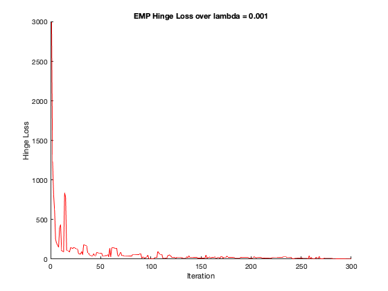

<h1 style="text-align:center">EECS 4404</h1>

<h2 style="text-align:center">Assignment 2</h2>


<ul>
    <h4 style="text-align:center">Name: Bochao Wang</h4>
    <h4 style="text-align:center">Student ID: 215237902</h4>
    <h4 style="text-align:center">Prism: bochao</h4>
    <h4 style="text-align:center">Date: Feb. 20th</h4>
</ul>

​    


**1. Gradient computation **

​	Let $X \in \reals ^{d * d}$ be some matrix. Consider the function $f:\ \Reals^d \rightarrow \Reals$ defined by $f(w) = w^T X w$, show that 	the gradient of this function with repect to $w$ is $\bigtriangledown f(w) = w^T(X+X^T)$

- Proof:
  - $\bigtriangledown f(w) = \begin{pmatrix}\frac{\partial f}{\partial w_1},&\frac{\partial f}{\partial w_2},&\ldots &\frac{\partial f}{\partial w_d}\end{pmatrix}​$ 
  - $ f(w)= \begin{bmatrix}w_1&w_2&w_3&\ldots &w_d\end{bmatrix}\begin{bmatrix}x_{11}&x_{12}&x_{13}&\ldots &x_{1d}\\\\x_{21}&x_{22}&x_{23}&\ldots &x_{2d}\\\\x_{31}&x_{32}&x_{33}&\ldots &x_{3d}\\\\ \vdots &&&& \vdots\\\\ x_{d1}&x_{d2}&x_{d3}&\ldots &x_{dd} \end{bmatrix} \begin{bmatrix}w_1\\\\w_2\\\\w_3 \\\\ \vdots \\\\ w_d\end{bmatrix}$ 
  - $f(w)=\begin{bmatrix}\sum_{i=1}^d w_{i}x_{i1}, & \sum_{i=1}^d w_{i}x_{i2}, & \ldots & \sum_{i=1}^d w_{i}x_{id}\end{bmatrix} w= \sum_{j=1}^d \sum_{i=1}^d w_{i} x_{ij} w_{j}$ 
  - Simplify the function $f(w) = \sum_{j=1}^d (x_{jj}w_j^2+ \sum_{i \not=j}w_{i} x_{ij} w_{j})$
  - we can compute the partial derivative with element $k$, $\frac{\partial}{\partial w_k}[\sum_{j=1}^d (x_{jj}w_j^2+ \sum_{i \not=j}w_{i} x_{ij} w_{j})] =\sum_{j=1}^d (\frac{\partial}{\partial w_k}x_{jj}w_j^2+ \sum_{i \not=j}\frac{\partial}{\partial w_k}w_{i} x_{ij} w_{j}) = 2x_{kk}w_{kk} + \sum_{i \not=k} x_{ki}w_{i}+\sum_{i \not=k}w_ix_{ik}​$
  - $\because x_{kk}w_{kk} =x_{kk}w_{kk}$ Then, $\frac{\partial}{\partial w_k}[\sum_{j=1}^d (x_{jj}w_j^2+ \sum_{i \not=j}w_{i} x_{ij} w_{j})]=\sum_{i=1}^d x_{ki}w_{i}+\sum_{i=1}^dw_ix_{ik}$
  - $\bigtriangledown f(w)=\begin{bmatrix} \sum_{i=1}^d x_{1i}w_{i}+\sum_{i=1}^dw_ix_{i1}, &\sum_{i=1}^d x_{2i}w_{i}+\sum_{i=1}^dw_ix_{i2}, & \ldots &\sum_{i=1}^d x_{di}w_{i}+\sum_{i=1}^dw_ix_{id}\end{bmatrix}$ 
  - $\bigtriangledown f(w)=\begin{bmatrix} \sum_{i=1}^dw_ix_{i1}, &\sum_{i=1}^dw_ix_{i2}, & \ldots &\sum_{i=1}^dw_ix_{id}\end{bmatrix}+\begin{bmatrix} \sum_{i=1}^d x_{1i}w_{i}, &\sum_{i=1}^d x_{2i}w_{i}, & \ldots &\sum_{i=1}^d x_{di}w_{i}\end{bmatrix}​$ 
  - $\begin{bmatrix} \sum_{i=1}^dw_ix_{i1}, &\sum_{i=1}^dw_ix_{i2}, & \ldots &\sum_{i=1}^dw_ix_{id}\end{bmatrix}=w^TX$
  - $\begin{bmatrix} \sum_{i=1}^d x_{1i}w_{i}, &\sum_{i=1}^d x_{2i}w_{i}, & \ldots &\sum_{i=1}^d x_{di}w_{i}\end{bmatrix} = w^TX^T$ 
  - Thus, $\bigtriangledown f(w) = w^TX+w^TX^T=w^T(X+X^T) $


**2. Stochastic Gradient Descent**

Recall the logistic loos function, point wise defined as

​		$\mathcal{l}^{logist} (y_{\pmb{w}},(\pmb{x}, t))=ln(1+exp(-t<\pmb{w},\pmb{x}>))​$

We know that empirical logistic loss over a dataset

​		$\mathcal{L}^{logist} (y_{\pmb{w}})=\frac{1}{N} \sum_{n=1}^Nln(1+exp(-t_n<\pmb{w},\pmb{x}_n>))​$

(a) Compute the gradient with respect to $w​$ of the logistic loss $\mathcal{l}^{logist} (y_{\pmb{w}},(\pmb{x}, t))​$ on a data point $(x, t)​$.

- Solve:
  - $\mathcal{l}^{logist} (y_{\pmb{w}},(\pmb{x}, t))=ln(1+exp(-t * \sum_{i}^N w_ix_i))​$
  - $\bigtriangledown f(\pmb{w}) = \begin{pmatrix}\frac{\partial f}{\partial w_1},&\frac{\partial f}{\partial w_2},&\ldots &\frac{\partial f}{\partial w_d}\end{pmatrix}​$ 
  - $\bigtriangledown \mathcal{l}^{logist} (y_{\pmb{w}},(\pmb{x}, t))=\begin{pmatrix}\frac{1}{1+exp(-t * \sum_{i}^N w_ix_i)} \frac{\partial(1+exp(-t * \sum_{i}^N w_ix_i))}{\partial w_1}, && \frac{1}{1+exp(-t * \sum_{i}^N w_ix_i)} \frac{\partial(1+exp(-t * \sum_{i}^N w_ix_i))}{\partial w_2}, && \ldots, && \frac{1}{1+exp(-t * \sum_{i}^N w_ix_i)} \frac{\partial(1+exp(-t * \sum_{i}^N w_ix_i))}{\partial w_d}\end{pmatrix}​$
  - we compute the $k​$ element:
  - $\frac{\partial(1+exp(-t  \sum_{i}^N w_ix_i))}{\partial w_k} = e^{-t  \sum_{i}^N w_ix_i}  \frac{\partial(-t  \sum_{i}^N w_ix_i)}{\partial w_k} = e^{-t  \sum_{i}^N w_ix_i}  (-tx_k)= e^{-t <\pmb{w}, \pmb{x}>}(-tx_k) ​$ 
  - $\bigtriangledown \mathcal{l}^{logist} (y_{\pmb{w}},(\pmb{x}, t))=\begin{pmatrix}\frac{e^{-t <\pmb{w}, \pmb{x}>}}{1+exp(-t * \sum_{i}^N w_ix_i)} (-tx_1), && \frac{e^{-t <\pmb{w}, \pmb{x}>}}{1+exp(-t * \sum_{i}^N w_ix_i)} (-tx_2), && \ldots, && \frac{e^{-t <\pmb{w}, \pmb{x}>}}{1+exp(-t * \sum_{i}^N w_ix_i)}(-tx_d)\end{pmatrix}​$
  - $\bigtriangledown \mathcal{l}^{logist} (y_{\pmb{w}},(\pmb{x}, t))=\begin{pmatrix}\frac{e^{-t <\pmb{w}, \pmb{x}>}}{1+exp(-t <\pmb{w}, \pmb{x}>)} (-tx_1), && \frac{e^{-t <\pmb{w}, \pmb{x}>}}{1+exp(-t <\pmb{w}, \pmb{x}>)}  (-tx_2), && \ldots, && \frac{e^{-t <\pmb{w}, \pmb{x}>}}{1+exp(-t <\pmb{w}, \pmb{x}>)} (-tx_d)\end{pmatrix}$
  - $\bigtriangledown \mathcal{l}^{logist} (y_{\pmb{w}},(\pmb{x}, t))=\frac{e^{-t <\pmb{w}, \pmb{x}>}}{1+exp(-t <\pmb{w}, \pmb{x}>)} (-t\pmb{x})​$ 

(b) Describe Stochastic Gradient Descent with a fixed stepsize η with respect to the logistic loss

- Solve:

  1. $In: data \ D = ((\pmb{x}_1, t_1), (\pmb{x}_2, t_2), ..., (\pmb{x}_N, t_N))$
  2. $Parameters: \eta,\ T,\ n$
  3. $Initialize: w_0 = 0​$
  4. $For\ i = 0, ..., T$
  5. ​                  Choose a random data point $(\pmb{x}^*,t^*)$ form $D$
  6. ​                  so that $\pmb{w}_{i+1} = \pmb{w}_i - \eta * \frac{e^{-t^* <\pmb{w}, \pmb{x}^*>}}{1+exp(-t^* <\pmb{w}, \pmb{x}^*>)} (-t^*\pmb{x}^*)$
  7. $Output: \pmb{w} = {1 \over n} \sum_{k=T-n}^T \pmb{w}^k$

  - $T​$ is the number of updates
  - $\eta​$ is fixed stepsize
  - $n​$ compute average of last $n​$ iteration

(c) Compare the derived algorithm to the SGD algorithm we derived for SVM. What is similar? What is different? On what type of data would you expect to see different behavior?

- Solve: 
  - Similar :
    - The part (b) algrothim and we derived for SVM all use the gradient descent method to update and find the optimal $\pmb{w}$ so that minimize the loss.
    - Both algorithms would sample a data point $(\pmb{w}_i, t_i)$ uniformly at the random from dataset D to compute the gradient to update
    - Both algorithms compute the average $\pmb{w}$ of last $n​$ iterations.
  -  Different:
    - part (b) use fixed stepsize $\eta​$, SVM we derived use stepsize sequence $\eta * j = {1\over \lambda *j}​$ where $j​$ is current step number. It means in SVM, the stepsize would less and less in each step, it would more accuracy to be closed minimum. 
    - Part(b) compute the gradient and SVM compute a subgradient only with respect to one points which can speed up the convergence of SGD
    - Part(b) consider the gradient of logistic loss, but SVM consider the gradient of hinge loss.The logistic loss would close to 0, but never be 0; the hinge loss would be 0 if $t_i<\pmb{w},x_i>\ > 1$ ; The gradient of hinge loss function is a piecewise-defined function, but the gradient of logistic loss is comtinuous.
  - The hinge loss would handle the data where are not differentiable. but logistic loss 


**3. SoftSVM optimization**

(a) Implement SGD for SoftSVM.

`soft_svm`

```matlab
function [w, hi_loss, bi_loss] = soft_svm(D,T,lambda, n)
% Initialize
[N, clo] = size(D);
x = D(:,1:clo-1); % features
t = D(:,clo); % label {-,+}
theta=zeros(1,clo-1);

hi_loss = zeros(T,1);
bi_loss = zeros(T,1);

% store `w` in each iteration
ws=zeros(T,clo-1);

for j = 1:T
    
    % update `w`
    w_j = (1/(j*lambda))*theta;
    
    % store the `w` in `ws`
    ws(j,:) = w_j;
 
    % Choose the i in uniform distribution
    i = unidrnd(N);
    
    if t(i) * dot(w_j, x(i,:)) < 1
        
        theta = theta + t(i)*(x(i,:));
        
    end
    
    % Track the emprical and hinge loss
    hi_loss(j,:) = emp_loss(w_j, D, 'hinge');
    bi_loss(j,:) = emp_loss(w_j, D, 'binary');
end

if(n ~= 0)
    w = (1/n) * sum(ws((T-n-1:T),:));
else
    w = w_j;
end
```

`emp_loss`

```matlab
function emr_loss = emp_loss(w, D, flag)
% L_D(w)=(1/N)sum(loss(w,(x_i, t_i)))
[N,clo] = size(D);
l=0;
for i = 1:N
    x_i = D(i,1:clo-1);
    t_i = D(i,clo);
    if(strcmpi(flag, 'hinge'))
        l = l + hinge_loss(w, x_i, t_i);
    elseif(strcmpi(flag, 'binary'))
        l = l + binary_loss(w, x_i, t_i);
    end
end    
emr_loss = (1/N) * l;
```


(b) Run the optimization method with various values for the regularization parameter $\lambda=\{100,10,1,.1,.01,.001\} $ on the data.

`main.m`

```matlab
% PART (b) Run with lambda = {100, 10, 1, .1, .01, .001} on the data
% and print empiral hinge loss and empiral binary loss
clc;clear;close all;
dataset = load_data("bg.txt");
num_updates = 300;
s_lambda = [100, 10, 1, .1, .01, .001];
n = 1;

for i = 1:length(s_lambda)
    [w,hi_loss,bi_loss] = soft_svm(dataset, num_updates, s_lambda(i), n);
  
    figure
    title(['EMP Hinge Loss over lambda = ', num2str(s_lambda(i))])
    hold on
%     set(gca, 'YScale', 'log'); % set y-axis as log
    plot(hi_loss, 'Color', 'red'); 
    xlabel('Iteration'); 
    ylabel('Hinge Loss');
    hold off
    
    figure
    title(['EMP Binary Loss over lambda = ', num2str(s_lambda(i))])
    hold on
%     set(gca, 'YScale', 'log'); % set y-axis as log
    plot(bi_loss, 'Color', 'blue');
    xlabel('Iteration'); 
    ylabel('EMP Binary Loss');
    hold off
end
```




 

(c) Discuss the plots. Are the curves monotone? Are they approximately monotone? Why or why not? How does the choice of $\lambda$ affect the optimization? How would you go about finding a linear predictor of minimal binary loss?

- Solve:
  - No, the curves are not strictly monotone. Because in each iteration, the SoftSVM pick random data point to compute the subgradient, sometimes, it may pick a noice data point, the loss would larger than previous iteration; sometimes, it may pick a same point as previous iteration, the loss would be 0. Thus, it not monotone.
  - Yes, they are approximately monotone. The trend of loss would montonely decreasing. Because SGD would always give the direction which decreasing fast. The loss would decrease globally.
  - Because stepsize sequence $\eta^j = {1 \over \lambda*j}$ and the $\lambda$ is on the denominator, when $\lambda$ is larger, the stepsize would small, and multiply the iteration number, the stepsize would smaller and smaller, it would be easier to be close the minimum.
  - 


