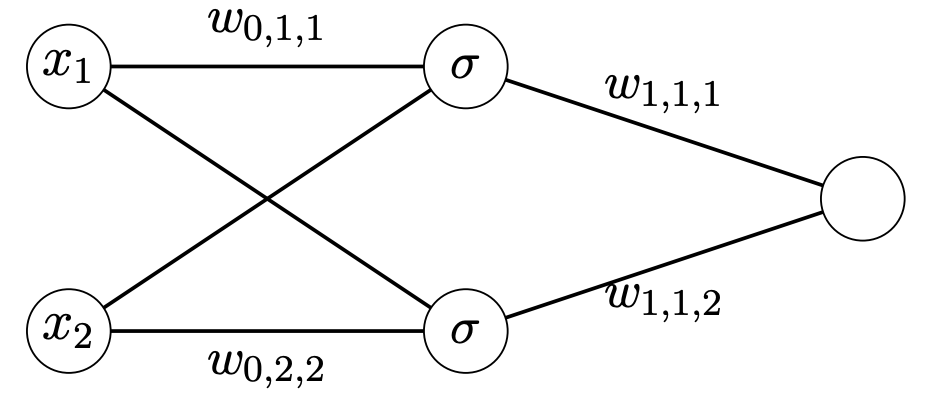

<h1 style="text-align:center">EECS 4404</h1>

<h2 style="text-align:center">Assignment 3</h2>

<ul>
    <h4 style="text-align:center">Name: Bochao Wang</h4>
    <h4 style="text-align:center">Student ID: 215237902</h4>
    <h4 style="text-align:center">Prism: bochao</h4>
    <h4 style="text-align:center">Date: March. 31th</h4>
</ul>

​    

**1. Backpropagation **

Consider a neural network with one hidden layer containing two nodes, input dimension 2 and output dimension 1. That is, the fist layer contains two nodes $v_{0,1}$, $v_{0,2}$, the hidden layer has two nodes $v_{1,1}$, $v_{1,2}$, and the output layer one nodes $v_{2,1}$. All nodes between consecutive layers are connected by an edge. The weights between node $v_{t,i} $and$ v_{t+1,j}$ is denoted by $w_{t,j,i}$ as (partially) indicated here: The nodes in the middle layer apply a differentiable activation function $\sigma$ : $\R→ \R$, which has derivative $\sigma'$.

**(a)** The network gets as input a 2-dimensional vector $x = (x_1, x_2)​$. Give an expression for the output $N(x)​$ of the network as a function of $x_1​$, $x_2​$ and all the weights. 

- Solve:
  - $o_{1,1}(\pmb{x})=\sigma(x_1w_{0,1,1}+x_2w_{0,2,1})​$
  - $o_{1,2}(\pmb{x})=\sigma(x_1w_{0,2,1}+x_2w_{0,2,2})​$
  - $N(\pmb{x})=\sigma(o_{1,1}w_{1,1,1}+o_{1,2}w_{1,1,2})=\sigma(\sigma(x_1w_{0,1,1}+x_2w_{0,1,2})w_{1,1,1}+\sigma(x_1w_{0,2,1}+x_2w_{0,2,2})w_{1,1,2})$

**(b)** Assume we employ the square loss. Give an expression for the loss $\mathcal{l}(N(·),(\pmb{x}, t))​$ of the network on an example $ (\pmb{x}, t) ​$ (again, as a function of $x_1​$, $x_2​$, t and all the weights).

- Solve:
  - $\mathcal{l}^2(N(·),(\pmb{x}, t))={1\over2}||N(x)-t||^2​$
  - $\mathcal{l}^2(N(·),(\pmb{x}, t))={1\over2}||\sigma(\sigma(x_1w_{0,1,1}+x_2w_{0,1,2})w_{1,1,1}+\sigma(x_1w_{0,2,1}+x_2w_{0,2,2})w_{1,1,2})-t||^2​$

**(c)** Consider the above expression of the loss as a function of the set of weights $L(w_{0,1,1}, w_{0,2,1}, w_{0,1,2}, w_{0,2,2}, w_{1,1,1}, w_{1,1,2}) = \mathcal{l}(N(·),(\pmb{x}, t))​$. Compute the 6 partial derivatives

- Solve:

  - $\mathcal{l}^2(N(·),(\pmb{x}, t))={1\over2}||\sigma(\sigma(x_1w_{0,1,1}+x_2w_{0,1,2})w_{1,1,1}+\sigma(x_1w_{0,2,1}+x_2w_{0,2,2})w_{1,1,2})-t||^2​$

    ​			$={1\over 2} ||\sigma(\sigma(a_{1,1})w_{1,1,1}+\sigma(a_{1,2})w_{1,1,2})-t||^2​$

    ​			$= {1\over 2}||\sigma(o_{1,1}w_{1,1,1}+o_{1,2}w_{0,1,2})-t||^2$

  - ${\partial{L}\over\partial{w_{1,1,1}}}=\sigma’(\sigma(x_1w_{0,1,1}+x_2w_{0,1,2})w_{1,1,1}+\sigma(x_1w_{0,2,1}+x_2w_{0,2,2})w_{1,1,2}) ((\sigma(x_1w_{0,1,1}+x_2w_{0,1,2})w_{1,1,1})' + (\sigma(x_1w_{0,2,1}+x_2w_{0,2,2})w_{1,1,2})')$

    ​	$= \sigma'(o_{1,1}w_{1,1,1}+o_{1,2}w_{1,1,2})(0+\sigma(a_{1,1})+0+0)$

    ​	$= \sigma'(a_{2,1})o_{1,1}$

  - ${\partial{L}\over\partial{w_{1,1,2}}}=$

  - 

(\sigma'(\sigma(x_1w_{0,1,1}+x_2w_{0,2,1}) \sigma'(x_1w_{0,1,1}+x_2w_{0,2,1}))