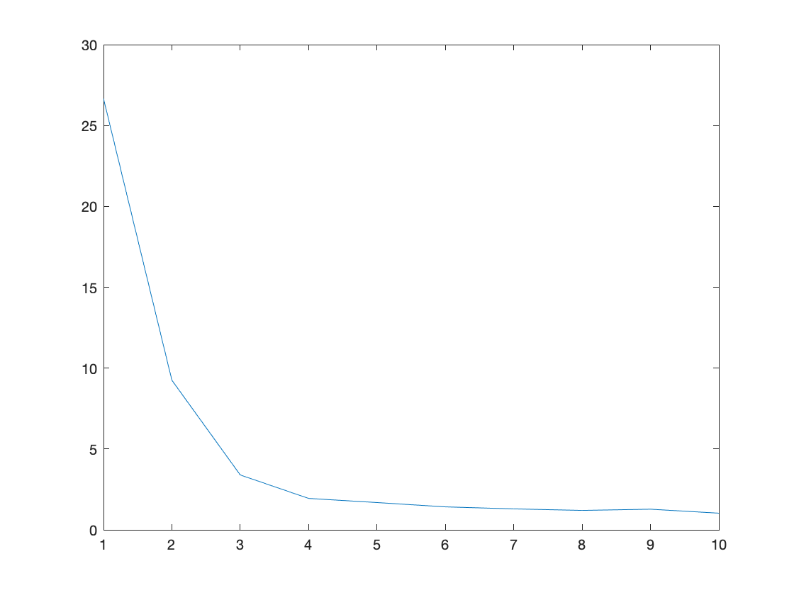
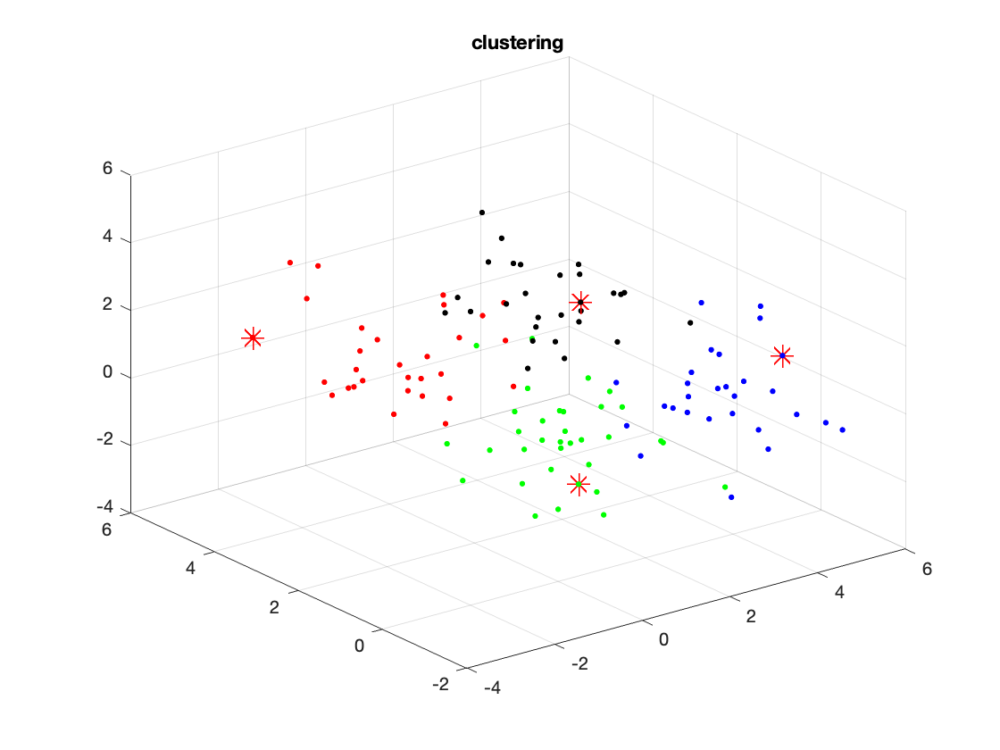

<h1 style="text-align:center">EECS 4404</h1>

<h2 style="text-align:center">Assignment 3</h2>


<ul>
    <h4 style="text-align:center">Name: Bochao Wang</h4>
    <h4 style="text-align:center">Student ID: 215237902</h4>
    <h4 style="text-align:center">Prism: bochao</h4>
    <h4 style="text-align:center">Date: March. 31th</h4>
</ul>


​    


**1. Backpropagation **

Consider a neural network with one hidden layer containing two nodes, input dimension 2 and output dimension 1. That is, the fist layer contains two nodes $v_{0,1}$, $v_{0,2}$, the hidden layer has two nodes $v_{1,1}$, $v_{1,2}$, and the output layer one nodes $v_{2,1}$. All nodes between consecutive layers are connected by an edge. The weights between node $v_{t,i} $and$ v_{t+1,j}$  is denoted by $w_{t,j,i}$ as (partially) indicated here: The nodes in the middle layer apply a differentiable activation function $\sigma$ : $\R→ \R$, which has derivative $\sigma'$.


**(a)** The network gets as input a 2-dimensional vector $x = (x_1, x_2)​$. Give an expression for the output $N(x)​$ of the network as a function of $x_1​$, $x_2​$ and all the weights. 

- Solve:
  - $o_{1,1}(\pmb{x})=\sigma(x_1w_{0,1,1}+x_2w_{0,2,1})$ 
  - $o_{1,2}(\pmb{x})=\sigma(x_1w_{0,2,1}+x_2w_{0,2,2})$ 
  - $N(\pmb{x})=\sigma(o_{1,1}w_{1,1,1}+o_{1,2}w_{1,1,2})=\sigma(\sigma(x_1w_{0,1,1}+x_2w_{0,1,2})w_{1,1,1}+\sigma(x_1w_{0,2,1}+x_2w_{0,2,2})w_{1,1,2})$ 


**(b)** Assume we employ the square loss. Give an expression for the loss $\mathcal{l}(N(·),(\pmb{x}, t))$ of the network on an example $ (\pmb{x}, t) $ (again, as a function of $x_1$, $x_2$, t and all the weights).

- Solve:
  - $\mathcal{l}^2(N(·),(\pmb{x}, t))={1\over2}||N(x)-t||^2​$ 
  - $\mathcal{l}^2(N(·),(\pmb{x}, t))={1\over2}||\sigma(\sigma(x_1w_{0,1,1}+x_2w_{0,1,2})w_{1,1,1}+\sigma(x_1w_{0,2,1}+x_2w_{0,2,2})w_{1,1,2})-t||^2$ 


**(c)** Consider the above expression of the loss as a function of the set of weights $L(w_{0,1,1}, w_{0,2,1}, w_{0,1,2}, w_{0,2,2}, w_{1,1,1}, w_{1,1,2}) = \mathcal{l}(N(·),(\pmb{x}, t))$ . Compute the 6 partial derivatives

- Solve:

  - $\mathcal{l}^2(N(·),(\pmb{x}, t))={1\over2}||\sigma(\sigma(x_1w_{0,1,1}+x_2w_{0,1,2})w_{1,1,1}+\sigma(x_1w_{0,2,1}+x_2w_{0,2,2})w_{1,1,2})-t||^2​$

    ​			$={1\over 2} ||\sigma(\sigma(a_{1,1})w_{1,1,1}+\sigma(a_{1,2})w_{1,1,2})-t||^2​$

    ​			$= {1\over 2}||\sigma(o_{1,1}w_{1,1,1}+o_{1,2}w_{0,1,2})-t||^2$

  - ${\partial{L}\over\partial{w_{1,1,1}}}=\sigma(\sigma(x_1w_{0,1,1}+x_2w_{0,1,2})w_{1,1,1}+\sigma(x_1w_{0,2,1}+x_2w_{0,2,2})w_{1,1,2}) \sigma’(\sigma(x_1w_{0,1,1}+x_2w_{0,1,2})w_{1,1,1}+\sigma(x_1w_{0,2,1}+x_2w_{0,2,2})w_{1,1,2}) ((\sigma(x_1w_{0,1,1}+x_2w_{0,1,2})w_{1,1,1})' + (\sigma(x_1w_{0,2,1}+x_2w_{0,2,2})w_{1,1,2})')$

    ​	$= o_{2,1}\sigma'(o_{1,1}w_{1,1,1}+o_{1,2}w_{1,1,2})(0+\sigma(a_{1,1})+0+0)$ 

    ​	$= o_{2,1}\sigma'(a_{2,1})o_{1,1}​$ 

  - ${\partial{L}\over\partial{w_{1,1,2}}}=o_{2,1}\sigma'(a_{2,1})o_{1,2}$ 

  - ${\partial{L}\over\partial{w_{0,1,1}}}=o_{2,1}\sigma'(a_{2,1})\sigma'(a_{1,1})x_{1}w_{1,1,1}​$ 

  - ${\partial{L}\over\partial{w_{0,1,2}}}=o_{2,1}\sigma'(a_{2,1})\sigma'(a_{1,1})x_{2}w_{1,1,1}$ 

  - ${\partial{L}\over\partial{w_{0,2,1}}}=o_{2,1}\sigma'(a_{2,1})\sigma'(a_{1,2})x_1w_{1,1,2}$ 

  - ${\partial{L}\over\partial{w_{0,2,2}}}=o_{2,1}\sigma'(a_{2,1})\sigma'(a_{1,2})x_2w_{1,1,2}$ 


**2. k-means clustering**

**(a)** Implement the k-means algorithm and include your code in your submission

- `k_means_alg.m`

- ```matlab
  function [C, cost] = k_means_alg(D,k,init,init_centers)
  % N: the number of points
  % d: the dimension of each point
  [N, d] = size(D);
  
  % C : indecate each points belong to which class (k=1,2,..or K)
  C = zeros(N,1);
  
  % three ways to init:
  % 1. simply set the inital centers by hand
  % 2. choose k datapoints uniformly at random from the dataset
  % 3. choose the first center uniformly at random, and then choose 
  %    each next center to be the datapoint that maximizes the sum of
  %    (euclidean) distances from the previous datapoints
  centers = zeros(k, d); % init k-centers
  if (strcmpi(init, 'manual'))
      
      % generate the random number in [p_min,p_max] area
      centers = init_centers;
  elseif (strcmpi(init, 'uniform'))
      for i = 1:k
          j = unidrnd(N); % choose index j uniformly at random
          centers(i,:) = D(j,:); % choose jth points uniformly at random
      end  
  elseif (strcmpi(init, 'euclidean'))
     % 1st center
     j = unidrnd(N); % choose index j uniformly at random
     centers(1,:) = D(j,:); % choose jth points uniformly at random as first center   
     % 2nd center
     previous_point = centers(2,:); 
     % cpmpute the eucliden distances
     distances = zeros(N,1);      
     for n_p = 1:N
         distances(n_p,:) = norm(previous_point-D(n_p));
     end    
     % find the max distance point
     max_i = find(distances==max(distances),1);   
     % set this point as point
     centers(2,:) = D(max_i,:);
     % next centers
     for i = 3:k
         previous_centers = centers(1:i-1,:);
         % cpmpute the sum of eucliden distances
         distances = zeros(N,1);
         [n_c,~]=size(previous_centers);
         for c = 1:n_c
             for n_p = 1:N
                 distances(n_p,:) = distances(n_p,:) + norm(previous_centers(c,:)-D(n_p,:));
             end
         end      
         % find the max distance point
         max_i = find(distances==max(distances),1);     
         % set this point as point
         centers(i,:) = D(max_i,:); 
     end
  end
  % repeat until convergence
  itr = 0;
  max_itr = 100;
  while 1  
     % compute nearest point index
     for i = 1:N  
         dists = zeros(k,1);
         for j = 1:k
             dists(j,:) = norm(D(i,:)-centers(j,:));
         end
         % mark this point which class belongs to
         C(i,1) = find(dists==min(dists),1); 
     end
     % store old centers
     old_centers = centers;
     % update the center
     for i = 1:k
         neares_i = find(C(:,1)==i);
         centers(i,:) = mean(D(neares_i,:));
     end 
     % stop when centers are not uptated
     if isequal(old_centers,centers)
         break;
     end
     % prevent from dead loop
     itr = itr + 1;
     if itr > max_itr
         break
     end 
  end
  b_cost = 0;
  for i = 1:N
      b_cost = b_cost + norm(D(i,:) - centers(C(i,:),:));
  end
  cost = b_cost/N;
  ```


**(b)** Load the first dataset `twodpoints.txt`. Plot the datapoints.

​	

Which number of clusters do you think would be suitable from looking at the points? 

- 3 clusters is suitable.

- Set centres by band

- ```matlab
  % init by hand
  init_centers = zeros(3,d);
  init_centers(1,:)=[0.04607 4.565];
  init_centers(2,:)=[-3.983 -3.781];
  init_centers(3,:)=[2.993 -2.907];
  % set k clusters, and init method
  k = 3;
  init = 'manual';
  % clustering
  [cluster_i,~] = k_means_alg(twoD,k,init,init_centers);
  ```

- 1st instance

-  

- 2st instance
-  

**(c)** Can the above phenomenon also happen if the initial centers are chosen uniformly at random? What about the third way of initializing? For each way of initializing, run the algorithm several times and report your findings.

- Initial centers uniformly at random
- Fig 1
- Fig 2
  - When  the initial centers are chosen uniformly at random, almost time the points would cluster as same as previous plot (like fig 1), in a few time, it would be different (like fig 2).
- Third way of initializing
- Fig 3
  - When we use third way of initializing, the culstering (fig 3) would always same as first way.
- For each way of initializing, run the algorithm several times and report your findings. 
  - The first way always got same clustering and the third way always got the clustering same as the first way. But the second way, sometime got the clustering same as the first and the third way, in a few tiems, it would got different clustering like Fig 2, which would split the points on the top of the picture, but would not split the bottom.


**(d)** From now on, we will work with the third method for initializing cluster centers. Run the algorithm for $k = 1, . . . 10$ and plot the k-means cost of the resulting clustering 

-  

- What do you observe? How does the cost evolve as a function of the number of clusters? How would you determine a suitable number of clusters from this plot (eg in a situation where the data can not be as obviously visualized).
  - From $k=1$ to $k=4$, the cost would decrease more acutely, when $k$ is larger than 4, the cost would keep balance relatively, which decreases very slowly. When $k=4 $, the cost is minimal relatively. 
  - we can choose $k$ such that minimizes the cost. In this part, we can choose $k=$4 
  - Like fig 4:
  - Fig 4 


**(e)** Repeat the last step (that is, plot the cost as a function of $k = 1, . . . , 10​$) for the next dataset `threedpoints.txt`. What do you think is a suitable number of clusters here? Can you confirm this by a visualization?

- `threedpoints.txt` cost of $k = 1, . . . , 10$
- 
- By the plot of the cost, we should choose $k=4$
- Origin dataset 
- $k=3$ 


**(f)** Load the UCI “seeds” dataset from the last assignment and repeat the above step.

- From how the the k-means cost evolves, what seems like a suitable number of clusters for this dataset?
  - 
  - Based on the plot of cost, it would be **3 clusters** for this dataset.
  - we choose **k = 3** in next part.

- How could you use this for designing a simple 3-class classifier for this dataset? What is the empirical loss of this classifier?

  - we can choose a three initial centers by hand from each class {1, 2, 3}

  - The `k_means_alg.m` would see part (a)

  - 1st approach choose three point fixed in each class:

  - ```matlab
    % load data
    seedD=load('seeds_dataset.txt');
    [~, d] = size(seedD);
    % remove last col
    seedD=seedD(:,1:d-1);
    [N, d] = size(seedD);
    % set k clusters, and init method
    k = 3;
    init = 'manual';
    % init by hand
    init_centers = zeros(k,d);
    init_centers(1,:)=[15.26 14.84 0.871 5.763 3.312 2.221 5.22];
    init_centers(2,:)=[16.84 15.67 0.8623 5.998 3.484 4.675 5.877];
    init_centers(3,:)=[11.21 13.13 0.8167 5.279 2.687 6.169 5.275];
    % clustering
    [cluster_i,cost] = k_means_alg(seedD,k,init,init_centers);
    cost
    ```

  - 2nd approach we random choose three points in each three classed respectively.

  - ```matlab
    % load data
    seedD=load('seeds_dataset.txt');
    [~, d] = size(seedD);
    % init centers
    init_centers = zeros(3,d-1);
    for i = 1:3
        D=seedD((seedD(:,d)==i),:);
        init_centers(i,:) = D(unidrnd(70),1:d-1);
    end
    % remove last col
    seedD=seedD(:,1:d-1);
    [N, d] = size(seedD);
    % set k clusters, and init method
    k = 3;
    init = 'manual';
    % init by hand
    init_centers = zeros(k,d);
    % clustering
    [cluster_i,cost] = k_means_alg(seedD,k,init,init_centers);
    cost
    ```

  - 3rd approach we use third method to initialize the initial centres, set $k=3$

  - ```matlab
    % load data
    seedD=load('seeds_dataset.txt');
    [~, d] = size(seedD);
    seedD=seedD(:,1:d-1);
    [N, d] = size(seedD);
    % set k clusters, and init method
    k = 3;
    init = 'euclidean';
    % clustering
    [cluster_i,cost] = k_means_alg(seedD,k,init,0);
    cost
    ```

  - All of approach the cost is `1.4915` approximately in several times running.

  

**(g)** Design a simple (two-dimensional) dataset where the 2-means algorithm with the third initialization method will always fail to find the optimal 2-means clustering. Explain why it will fail on your example or provide plots of the data with initializations and costs that show that 2-means converges to a suboptimal clustering.

- 


